# Omarchy Kids

Selectable parental-control and learning modules for Omarchy.

| Module | Package | What it includes |
| --- | --- | --- |
| Kids / Parent Password | `omarchy-kids-core` | Required foundation: parent password, child profile controls, shared authentication, module picker and service host. |
| DNS Filtering | `omarchy-kids-dns` | Domain and page lists, resolver, firewall rules and managed browser policies. |
| Browsing Logging | `omarchy-kids-browsing` | Browser-history collection, page/video reports and its collection timer. |
| Screen Time and Math | `omarchy-kids-time` | Daily budgets, bedtime, time grants and arithmetic practice. |
| School / Free Time | `omarchy-kids-school` | School schedule, app list, desktop restrictions and password-protected free time. |
| Number Grove | `omarchy-kids-grove` | Original arithmetic garden game with grades 1–6, calm/adventure play and optional screen-time rewards. |

The five optional modules can be installed and removed individually. School mode works without screen time. Removing an optional module preserves its settings and history; removal first disables its services and restores its desktop or browser changes. Browsing logging is enabled only by an explicit parent action.

The existing `omarchy.screen-time`, `omarchy.math` and `omarchy.school-mode` shell plugins are reused. There is one browser profile. Grades 5 and 6 use multiplication and division tables exclusively; younger grades practice small arithmetic facts. Selecting free time always requires the parent password, and the password field shows “Checking password…” while authentication runs.

## Number Grove

An original arithmetic game: guide a seed courier around a garden, collect the correct answer, and dodge wandering drift bugs. Choose calm mode to let the bugs rest. Ten facts make a practice round; incorrect answers reveal the fact to remember. Grades 5 and 6 are entirely multiplication and division tables through 12.

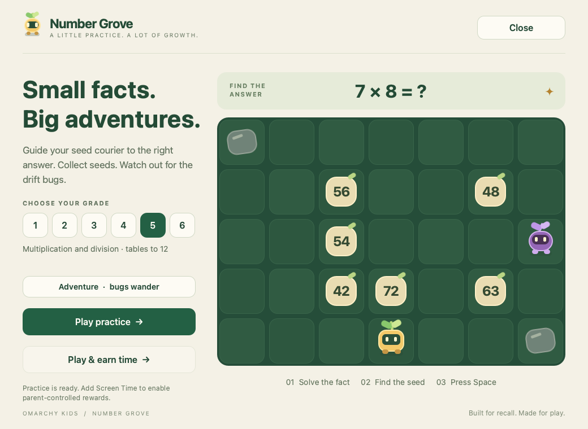

Number Grove is its own optional package. Practice works with **Kids core + Grove**; it does not need Screen Time, School Mode, DNS filtering or browsing logging. If Screen Time is installed and enabled, **Play & earn time** uses the parent's grade, reward settings and daily cap. School Mode's app list still applies.

After building the updated release on your Omarchy laptop, add the game while updating your installed modules:

```bash
./packaging/build
./packaging/install ./build-output --user CHILD_USERNAME grove
omarchy kids grove
```

With a current package cache, you can also use `omarchy kids plugin add grove`. Launch **Number Grove** from the application menu or with `omarchy kids grove`; remove it with `omarchy kids plugin remove grove`. It is ready after installation and has no separate enable step. Arrow keys or WASD move, Space/Enter collects, and P/Escape pauses. Switching away pauses the game until you resume.

See the [game architecture and local checks](docs/number-grove.md). The screenshot is a local Qt component render; a new Linux package release and ISO have not been built for this addition.

## Demo highlights

A full desktop view followed by short clips from the recorded demo. The GIFs are cropped to keep the controls readable; the math clip skips ahead between questions.

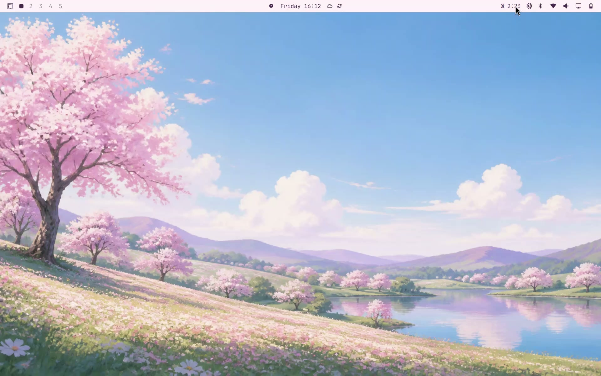

**Unlock with either password.** The lock screen accepts the kid password or the adult (parent) password.

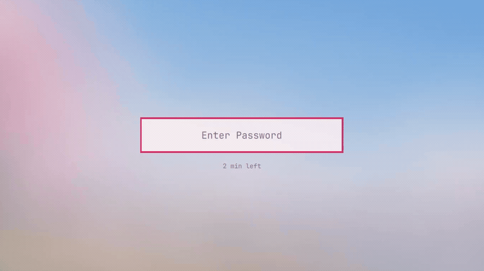

**Earn screen time with math.** Practice multiplication and division facts, then collect the reward for a completed set. This demo earns 30 minutes.

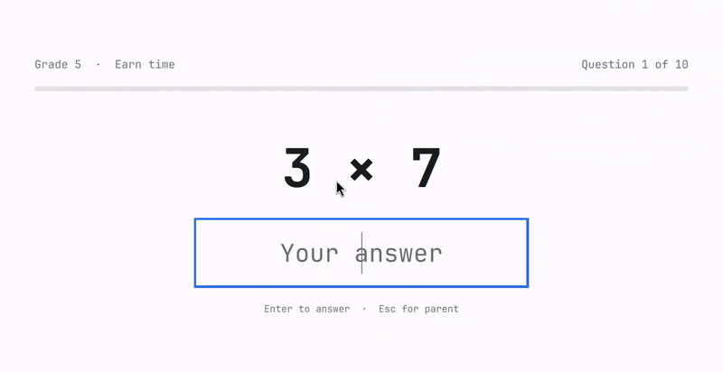

**Switch to free time.** Returning from school mode requires the parent password.

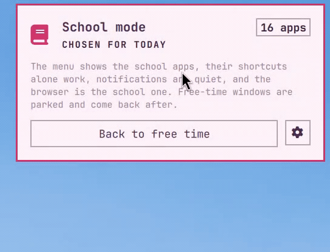

**Set daily limits and school hours.** Choose a budget for each day and configure bedtime and school schedules.

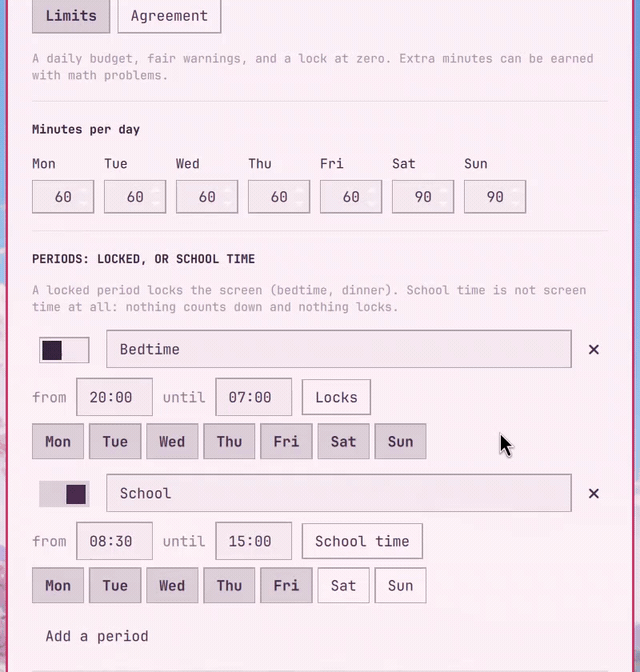

## Install on an existing Omarchy laptop

A parent can convert a clean **Omarchy 4** installation without reinstalling the OS. Use the laptop’s existing regular account as the kid account. The installer keeps its login password, home and desktop configuration, asks for a separate parent password, and installs all six modules. The parent password authorizes administration and also unlocks the login and lock screens. On an encrypted laptop it is added as another disk-unlock key; existing keys are kept. An unencrypted disk stays unencrypted.

In your `omarchy-kids` checkout on the Omarchy laptop, run these commands one at a time as the regular signed-in user:

```bash
omarchy pkg add base-devel python git imagemagick
./packaging/build
./packaging/install ./build-output --user CHILD_USERNAME --convert
```

Replace `CHILD_USERNAME` with the existing account name (`whoami` shows it). The initial sudo prompt uses the account’s current password; the installer then asks you to choose and confirm the parent password. On an encrypted laptop, enter the current disk-unlock password when asked. Reboot before handing the laptop to the kid: existing processes retain their old administrator groups until then.

Conversion currently supports one regular account with the standard Omarchy 4 package layout and setup. It refuses older layouts and custom sudo rules that need individual review. Recovery copies and a progress journal are kept in the root-only `/var/lib/omarchy/kids-conversion` directory. If an installation stops, fix the reported problem and rerun the same command; it resumes for the same account without removing existing disk keys. Do not restore a LUKS header or account files as a routine undo step; the backup is for recovery from a live USB if needed.

On an already configured kids laptop, install every module with:

```bash
./packaging/install ./build-output --user CHILD_USERNAME --all
```

For a smaller installation, list the optional modules instead of `--all`, for example `dns school`. Add `--convert` as well when converting a normal installation. Core is always installed, and existing module selections and enrollments are preserved. Installing code alone does not start logging or impose an optional restriction; the parent enables and configures restriction modules through **Setup → Kids Modules**.

Both deployment paths install a matching `omarchy-kids-base` / `omarchy-kids-settings` pair and use `/usr/share/omarchy` as `OMARCHY_PATH`. This pair replaces the monolithic Omarchy packages in one transaction. The previous source checkout is kept. All eight package archives remain in `/var/cache/omarchy-kids/packages` so another module can be installed later without rebuilding. ARM runtime validation remains outstanding.

## Install a fresh laptop with the Kids ISO

The dedicated Kids ISO carries the same eight packages, including all six modules, in its offline mirror. Its setup creates a kid account and asks for separate kid and parent passwords. An encrypted installation accepts either password at disk unlock. Account setup uses the same command as conversion, and the target retains the complete package cache for future module changes.

The ISO build is independent of upstream accepting the child-profile PR. Build and validation instructions are in [the deployment guide](docs/kids-deployment.md).

### ISO installer screenshots

Captured during an encrypted Kids ISO installation in a test VM. These show setup through the reboot prompt; first-boot disk unlock and desktop validation are still pending. Click a screenshot to view it at full size.

| 1. Welcome screen | 2. Child profile |
| --- | --- |
| [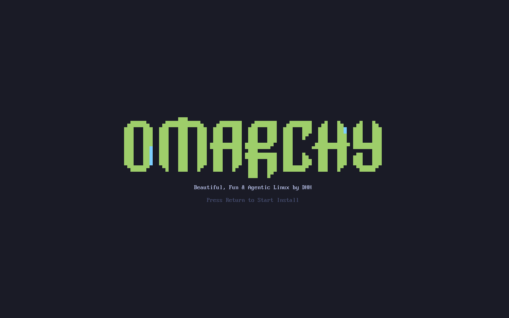](docs/images/iso/01-welcome.png) | [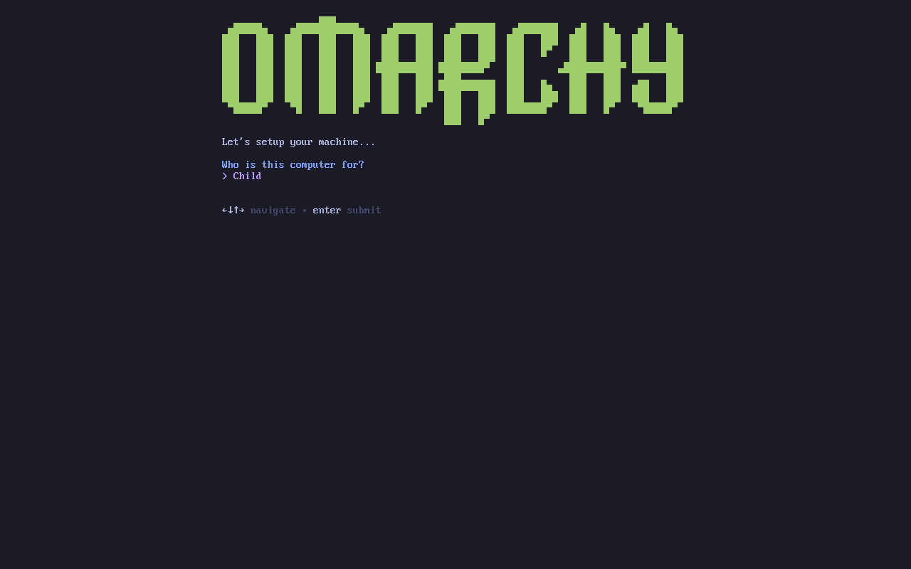](docs/images/iso/02-child-profile.png) |
| **3. Kid password** | **4. Parent password** |
| [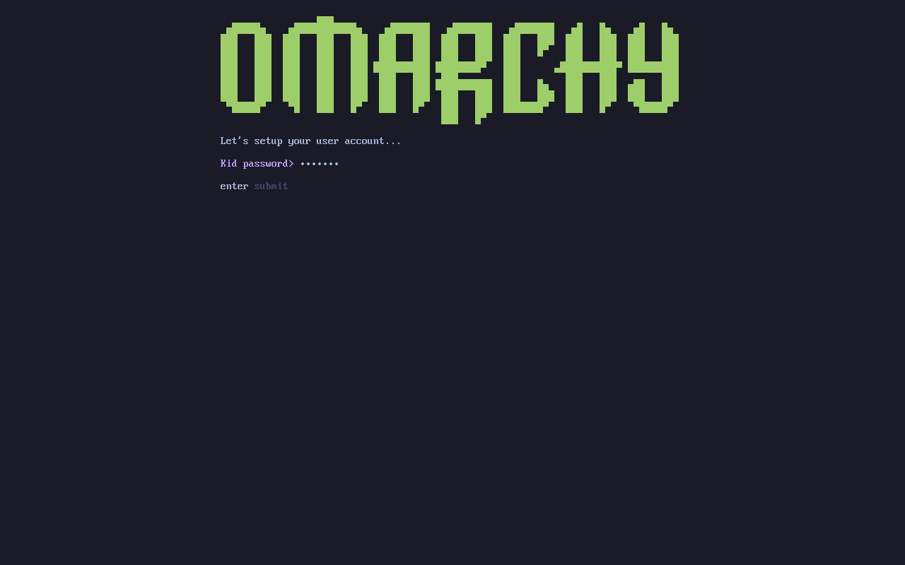](docs/images/iso/03-kid-password.png) | [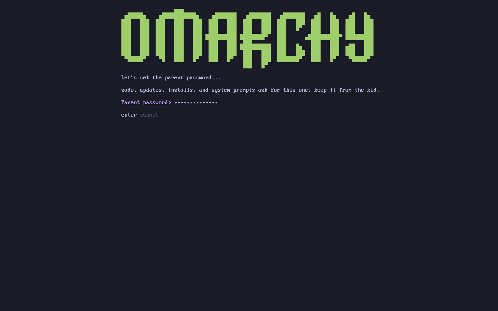](docs/images/iso/04-parent-password.png) |
| **5. Review setup** | **6. Installation complete** |
| [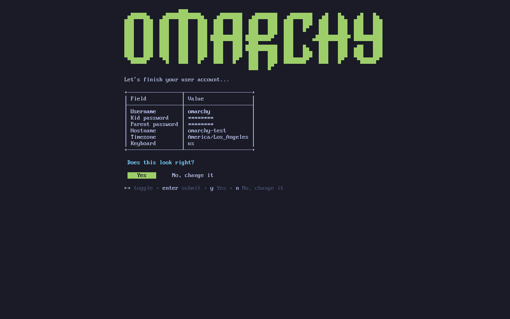](docs/images/iso/05-setup-review.png) | [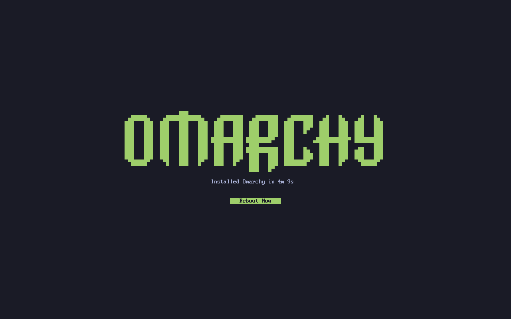](docs/images/iso/06-installation-complete.png) |

## Choose modules

From the child’s session:

```bash
omarchy kids plugin pick
omarchy kids plugin list
omarchy kids plugin add school
omarchy kids plugin enable school
omarchy kids plugin disable time
omarchy kids plugin remove browsing
```

The picker is also under **Setup → Kids Modules**, and is offered during first-boot provisioning when the module packages/cache are included in an image. Administrative actions ask for the parent password. Use `--user CHILD_USERNAME` when running from another account. `add time --enable` installs and enables screen time explicitly. Installing code alone does not start logging or impose a new restriction.

Examples of independent configuration:

```bash
omarchy kids school schedule mon-fri 08:00-15:30
omarchy kids school apps add obsidian
omarchy kids school mode free
omarchy kids time bedtime 20:30-07:00
omarchy kids time level grade5
omarchy kids time earn 10 30
```

The older `time school`, `time mode` and `time school-apps` commands forward to the school module.

## Update this build

```bash
git pull --ff-only
./packaging/build
./packaging/install ./build-output --user CHILD_USERNAME
```

A successful build replaces the previous package output. The installer verifies the complete release’s checksums and updates the compatible base pair, core and currently installed optional modules together. Standard `omarchy update` continues to update system packages; it does not fetch a new kids release from this repository. Switching to the upstream stable/edge packages is a separate migration and must not be mixed with these module packages.

The command family is `omarchy kids`, and the six module packages use the `omarchy-kids-` prefix. Upgrading a previous installation replaces its packages together and migrates the login rules, services and browser-policy filenames. Existing settings and history are preserved. Conflicting destination files or commands stop the upgrade for review; originals are backed up under `/var/lib/omarchy/kids-namespace-backup`.

The [namespace inventory](docs/kids-namespace-rename.md) lists every renamed source file and the compatibility references retained for upgrades and external plugins.

## Development and validation

```bash
./test/kids
./test/cli
```

The focused suite covers the existing password, arithmetic and browser-policy behavior; migration recovery; module lifecycle; and all 32 combinations of optional package contents. Builds and tests are run manually on local machines. Package-upgrade and conversion integration checks use a disposable Linux container; full desktop acceptance uses the disposable-VM procedure in [the acceptance guide](agents/skills/acceptance-tests.md).

See [module architecture and migration](docs/kids-modules.md), [the original design](plans/kids-modules.md), and [upstream Omarchy](https://github.com/basecamp/omarchy). Existing source history and vendored MIT licenses are retained.
